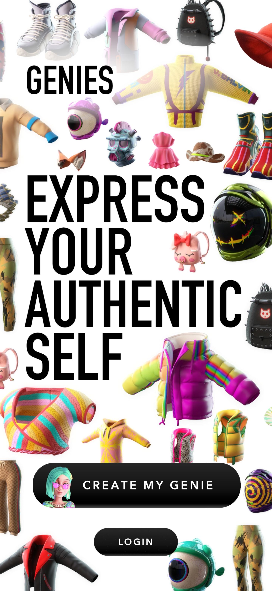

# Genies Avatar Authentication

## Modes of authenticating a user 

There are multiple ways of linking a user with their Genies Avatar: 
 
 - Using the pre-built Sign Up/Sign In forms in the [Genies Avatar Creator](#using-the-genies-avatar-creator)
 - Creating custom anonymous users (requires Genies approval)
 <!-- - Using OpenID connect to authenticate through a 3rd party ID provider -->

## Using the Genies Avatar Creator

The easiest way to link your users with their Genies Avatar is to use the [Avatar Creator](avatar_creator.md)

When using the [Avatar Creator](avatar_creator.md) users can create an Avatar Account and associate their personal avatar with it. Every Avatar created this way will get an associated `UserId` that needs to be stored and associated with the user of the Partner app. 

{: style="width:300px"}
{: style="width:300px"}


## Using anonymous managed user accounts
Another way of linking users with their Genies Avatar is using a [Partner API Account](#user-management-using-a-genies-partner-account) to create managed user accounts. The managed user accounts are anonymous and all user data is opaque to Genies (no personal user data is sent to Genies). 

For more information about using the Partner API Account check the [Managed Users](managed_users.md) section


### The Partner API Account
In order to created managed accounts for your users, you need to request specific access to this feature while applying for your [Partner Account](index.md#step-one-apply-for-a-partner-account). 

When approved access to the managed accounts feature, you'll receive credentials for a [Partner API Account](#using-the-partner-api-account). 

### Partner API Account Authentication
In order to manage anonymous user accounts you need to authenticate with your provided **Partner API Account credentials** and get the associated `IdToken` and `RefreshToken`.

Genies provides multiple ways of authenticating your Partner API Account: 

 - [HTTP requests](#partner-api-account-sign-in)
 - [Android API wrapper library](android.md#authentication-library)
 - iOS wrapper


#### IdToken and RefreshToken

The `IdToken` is used to authenticate all requests made by the Partner to the [Avatar API](assetsapi.md/#id-token) and the [Anonymous Users API](managed_users.md#id-token). It's usually sent as part of the `Authorization` header. 

The `RefreshToken` is used to authenticate all interactions with the [Avatar Creator](avatar_creator.md)

The `IdToken` and `RefreshToken` are provided when [signing in with a Partner API account](#partner-api-account-authentication)

### Partner API Account HTTP Authentication

The Avatar Authentication API uses [AWS Cognito](https://docs.aws.amazon.com/cognito-user-identity-pools/latest/APIReference/API_Operations.html) to handle authentication. The IdToken provided by the authentication flow is used to authenticate all the subsequent actions with the Avatar API.

#### HTTP Request URL
The Authentication API URL is:

```https://cognito-idp.us-west-2.amazonaws.com/```

#### Requests and response formats
The Avatar Authentication API uses HTTP POST requests with JSON arguments and JSON responses

#### HTTP Header Contents
The Avatar Authentication API requires the following information in the headers of an HTTP request:

 - **Content-Type**

    Specifies JSON and the version, for example, `Content-Type: application/x-amz-json-1.0`

- **X-Amz-Target**

    Specifies the Cognito Action type, for example: `'X-Amz-Target: AWSCognitoIdentityProviderService.InitiateAuth'`

#### HTTP Request Body
The Avatar API requests require the request body to be sent in JSON format. 

#### HTTP Responses
The Avatar API requests include JSON-formatted data in the response

#### Errors
When you send requests to and get responses from the Authentication API, you might encounter two types of API error:

- **Client errors**: 

    Client errors are indicated by a 4xx HTTP response code. Client errors indicate that Authentication API found a problem with the client request, such as an authentication failure or missing required parameters. 

- **Server errors**: 

    Server errors are indicated by a 5xx HTTP response code, and need to be resolved by the Amazon Cognito service

For each API error, the Authentication API returns the following values:

- **A status code**, for example, 400
- **An error code**, for example, ValidationException
- **An error message**, for example, `1 validation error detected: Value at 'password' failed to satisfy constraint: Member must have length greater than or equal to 6`


### Partner API Account Sign In 

To use your Partner API Account you should sign in and get the `IdToken` used to authenticate all other Avatar SDK interactions. 

To sign in you should use the `X-Amz-Target: AWSCognitoIdentityProviderService.InitiateAuth` action header and POST a JSON containing the `AuthFlow` key set to `USER_PASSWORD_AUTH` and an `AuthParameters` object with the `USERNAME` and `PASSWORD` keys. 


**Example**

```
curl --location --request POST 'https://cognito-idp.us-west-2.amazonaws.com/' \
--header 'X-Amz-Target: AWSCognitoIdentityProviderService.InitiateAuth' \
--header 'Content-Type: application/x-amz-json-1.1' \
--data-raw '{
    "AuthFlow": "USER_PASSWORD_AUTH",
    "ClientId": "YOUR_CLIENT_ID",
    "AuthParameters": {
        "USERNAME": "testuser@genies.com",
        "PASSWORD": "exampleToughPassword"
    }
}'
```

**Response**

```
HTTP/1.1 200 OK
Date: Thu, 21 Jan 2021 18:39:38 GMT
Content-Type: application/x-amz-json-1.1
Content-Length: 3879
Connection: keep-alive
x-amzn-RequestId: 0d716321-5de1-4a8a-87cf-6aca1aa47c89

{
    "AuthenticationResult": {
        "AccessToken": "eyJraWQiOiJ1Wnh4cHB2VGVvVFJURWZxeGpnZU1OVHd1XC9oQld3U29xMThOa2duQ0xvZz0iLCJhbGciOiJSUzI1NiJ9.eyJzdWIiOiJiNDRmYWEyZS0wMGI1LTQ5ZjItOWZiNC03ZWNjZTEzZjU0OGUiLCJldmVudF9pZCI6IjA2NjNlNWIxLTMxNTctNDEzNC04MmYzLWE4NGUwZGNiNGQyYiIsInRva2VuX3VzZSI6ImFjY2VzcyIsInNjb3BlIjoiYXdzLmNvZ25pdG8uc2lnbmluLnVzZXIuYWRtaW4iLCJhdXRoX3RpbWUiOjE2MTEyNTQwNTEsImlzcyI6Imh0dHBzOlwvXC9jb2duaXRvLWlkcC51cy13ZXN0LTIuYW1hem9uYXdzLmNvbVwvdXMtd2VzdC0yX0VoYnRyRmlFViIsImV4cCI6MTYxMTM0MDQ1MSwiaWF0IjoxNjExMjU0MDUxLCJqdGkiOiI4YTlkMjBhMS01YmRjLTQ0NDMtOTBmOC1mYjBkYzI4YTI2YWMiLCJjbGllbnRfaWQiOiIybnE4OXI1YjRzdHVnNWxzc2dsZmJncG5tIiwidXNlcm5hbWUiOiJiNDRmYWEyZS0wMGI1LTQ5ZjItOWZiNC03ZWNjZTEzZjU0OGUifQ.lcCE3siEZ8xIwsWkmc4GYvM8f6kDSR2rjY4bKvYe9HbEZXZUke6E4CfpJ6cM3lMpRqTTO4EEd3icIpqdKvBdtR_lxlk-OFxu20oQIuvhiFLaj_519OUCQL3PkasrvBiSHmjz56HaSTRoyzIfLUMBpGJjQnzmeq8PLmSQXw1i1jgyQjRViRLdPMP3ShpXQBnCSamgsnI0yhKMC7SDz5qwnenQm6DwqIHB43lcqDLmaB2T1JtlKnjmD7WG0jaDEMdED3k70iW6mDEOKBOi4-GSeRzRwsnl9uXDDManOogPBKz2Gjr_feGPFeQxF3N65DxRh3DNlObEpq4dPD_OUvkGHA",
        "ExpiresIn": 86400,
        "IdToken": "eyJraWQiOiJGckhlSlBKS1pUeUo0SkR3em9zQTNjYUM0MUNnSkJxZ0FGdUw5N1MwV3hBPSIsImFsZyI6IlJTMjU2In0.eyJzdWIiOiJiNDRmYWEyZS0wMGI1LTQ5ZjItOWZiNC03ZWNjZTEzZjU0OGUiLCJhdWQiOiIybnE4OXI1YjRzdHVnNWxzc2dsZmJncG5tIiwiZW1haWxfdmVyaWZpZWQiOmZhbHNlLCJldmVudF9pZCI6IjA2NjNlNWIxLTMxNTctNDEzNC04MmYzLWE4NGUwZGNiNGQyYiIsInRva2VuX3VzZSI6ImlkIiwiYXV0aF90aW1lIjoxNjExMjU0MDUxLCJpc3MiOiJodHRwczpcL1wvY29nbml0by1pZHAudXMtd2VzdC0yLmFtYXpvbmF3cy5jb21cL3VzLXdlc3QtMl9FaGJ0ckZpRVYiLCJjb2duaXRvOnVzZXJuYW1lIjoiYjQ0ZmFhMmUtMDBiNS00OWYyLTlmYjQtN2VjY2UxM2Y1NDhlIiwiZXhwIjoxNjExMzQwNDUxLCJpYXQiOjE2MTEyNTQwNTEsImVtYWlsIjoidGVtcG9yYXJ5QGdlbmllcy5jb20ifQ.BcqX5bviYoWDOO1dRd45xoJhPJFIEjFnJNaJYXcoomGob-RNn1MNIXr6qK4IcStX_0-EDjj7O7os5Psnq1Jyk3SOABUKyj1ThnAVBYXzfHAYSj5Q7n9D5wFh4rS1hnmkLQBw0ENNxwaf_sCuQh3x9M00bAy3gOH3Y4IPOCwN7T5n1_1x7TiZEZ1nXeZeSUUJnyzh63xpeB1XLtoBF1B2Sc3bfZQcF93hNGFKspxD5_wvX0dWNuMUr-xXDMSfG8L80p9CorkWEhmLCC7AKC2qK-YVJUcKScRS_kbM-Y0CUD0dRn6pmx8RG2D3-wJRonY2STV3ehWeYx17rA3gpl-c5g",
        "RefreshToken": "eyJjdHkiOiJKV1QiLCJlbmMiOiJBMjU2R0NNIiwiYWxnIjoiUlNBLU9BRVAifQ.BfxMdVNFP7f6W35WUlvihLhCPotJVoXPOHAP1GzU-UHT6WC8KbAFjT77UW22SlOQDlViUz-ykFBZmcYi44LSc9LGaFSPoOYsPpmRkzONqKlk9K9pJ2Wv8t_GaTKc7N5LxBefUpmdgVordpc4LWsJR0JhslR0yh7JsOLZtQ6AahEIzeecLdiBvIgCFpxE-RlqIc34FD_jikwfo6-j0_bFsmptl6BASJhN-K8OZuGXQWhzjjdvKi_h-tkqg2HuSDk52k2LRlg_iGWPoyFUomeWKn_02U1z0ojXjC9OV34u0Wgpmk_hpE34YXs-8fHkRP50YBV-iR4D8qMCdRALJvpYrQ.OlwZ35YXQ7OR5swV.6A7mLSo82yqTlaGRRTtDEklVBgjShZyvtkAqJr4sZ-ec3QqK_OZWWMsMTAIvcGHGxD1CTjZ7ZxFLgmGi17UkylknHmjkV0XzxGUFKMA_mMQcJpXOg58QTlLa2bdC_CAM7hFddZAHGsH7yJd4aZ_h-Bk2FQKlumDYSPufXm_GgJNCINKxzYofEK-GoZP38WO4PiSxuzhxbxPnWTxgbKJZjGhRwqzkYbPNnKLKhnV-qd7o57MrMRNaBUaLvNFJLTpsqJ8hDKDVl5BlkirLgBymQegkkQ4vjmBcfuASwMjALzjqmZpokoZ5ledGOn0lcTMKGRbKGe-x5AtnCFxduCwWJwQFoJgVa38wGrvo7_NUDTVEE_t3L-EwtlEXbOXkVOi8zdxWlsACQJhbTTpJKhJT9eAjhwKF-hkREwMgf7CyVddN-6oYMbPZiTWzkHxDetc03btRoI2iRfxUvwJ3IT59yX_QrNx4KG_Qr7RT3-bEOkBRO6j8PxB2-p79s86Wr4ExuNSo7_mTM2xoXNzp13kDjDAVx1tuyHv8xi6gM7IV4Ly82BroknTxL8vnurbLhQq38ZUNXtixajBPv2KvSBKtdojzq-v0SZn9BNdC66Nl3vEPA3yAOjcta3ehq_JixKC1Cf2dZ4xGfUBOSyXiTXBKZUMsXwesTQqzjZcgEOctAlVITuBhOJ3M78BxHlu-JBHTaxoERsnu3QJT0CN2juyyEZrTubkEhxhu97W_97eXj7AbrwqOIdEAPa8euA-2KpL4W8Fw3go-wyEEqa_ilobotygEomgo-Ql504wqsLAr7NOZEa5FU13kZ939jqEnkLCiIpsyDul0Z37FzbglOvzqykmW2XXyHOVMnSFuzKJI30hJ1txUftrzwZoXRU2_vP2cDN1bv8zYaTYUWkT-nVwGze57AGHkj9m-7Y-KqXYU5W4yPLCQzY9EeBqwXX34AscbpaxbuUONQjRtUpQjqXaZRqFnc-nPI5hoqYKjvR8FwjYDCO7huf9PCgl1oB2VR2m1s6N2CscFg2YAGZlSOJvlxlT3P9qytGYYK1-2ce1AfI2RLg6rurCgbqnFFfBSeqgTr48G95kWhYMlk1k28xs3DBmvNqbrsXrMmk2ZGcpy_TvA58-T-x5TPMo7bpPOSzPcGoJLadpVDv7lTuaUc8CY7L3Un1A1wifiJpY-O7d3wP8Jbmiq3b9NS2sB76h8t8ifVfZcbE20ECI_1-tD6Vw9lhYa6e3Vw3xNPLej0O6xWNR4EAgRKjcYikqfrkHhuWU-cCX513WiVRpoLl-9SS5pqELlLjYR2BJeV7-kVXE0Ly8jePcFut6GcE1P.miEFKs02GC-tXwUmvk0faw",
        "TokenType": "Bearer"
    },
    "ChallengeParameters": {}
}
```
#### Errors

 - **NotAuthorizedException**: Incorrect username or password.


### Refreshing the IdToken
The `IdToken` provided when signing in expires after 1 day and needs to be refreshed using the `RefreshToken`. The `RefreshToken` has a validity of 30 days. 
To refresh the tokens you should POST a JSON containing the `AuthFlow` key set to `REFRESH_TOKEN_AUTH` and a `AuthParameters` object containing the `RefreshToken`.

**Example**
```
curl --location --request POST 'https://cognito-idp.us-west-2.amazonaws.com/' \
--header 'X-Amz-Target: AWSCognitoIdentityProviderService.InitiateAuth' \
--header 'Content-Type: application/x-amz-json-1.1' \
--data-raw '{
	"AuthFlow": "REFRESH_TOKEN_AUTH",
	"ClientId": "YOUR_CLIENT_ID",
	"AuthParameters": {
		"REFRESH_TOKEN": "eyJjdHkiOiJKV1QiLCJlbmMiOiJBMjU2R0NNIiwiYWxnIjoiUlNBLU9BRVAifQ.RsNP_jdQ-ocBqevwXhpd_mYX2353asFU1ct2yKAnNqTycxxy5mAyTxEX2-60AjxPYmnXLA3l4P9FyKWyPenuYMt0fMIXJZjJ62ZYuKbnIaSBKFSdQPzDCEqCzaQr-vhdJEux4gwMkvnq0Medw7R-RokR3Y_vpl-XGPz3XKKSYycfNxW4YQQ5hlkAoX7Ni4ocMhVLE7hvw49aFWC4mVwmCmpacegMJDepTfTG5mtCt77VtlL3ZwWgXTEX8QTX9EIbDiFJ8k4lks6o8Ci99Spe-epvOrDyW7ZSov5j8ZYzCU7i6w7nJwwIAleFxBg-ogC6_vR4770CvDe1ygn2SQ0N4Q.Nz-pgOpahA145FWq.I9uxAY5V1X1QpIF4LeeToJcon27To5goGq-V7JpLLE-ou0OCl55cQgZxqvc6jspeIkyTQzwPQpmbIqv15UPMptM_qXQQp-6HT7LiL84GnIHL-nUe2wyyYvpvZpTxmLvbnIyEqxjLKjm_gALmDCL9Vb4mMa7Y504xwlqcutpogVLJFO2aMoShE5FrknYI6A2QbJPmpA9VJerxF3lfagCrxE5_u0gVIQWNxCvLfCklRnP5GArTlzhari3UnCW63Z0yf6_jHKe0NvdzFzgRZzD88j7yPZJvIZOVBKpv3PJ3k_6oVwm4A5wHNoF9UkLuWElPcywj7cwb8FcAV5rPDYxhSGqUBXCC2yrSteDS3gXq4xGRp6kJSQaTN9vfxYNpl_JcVlipEy3b5Lk5yEarxrEP5bmEaAhVzLzfvWkBcUrC5rXyPC83quojjj8_lKTFgVQabiO83j4Vi_2aYS7AIxeN5OdoHQ1qH50MeBU6ro6wZp8Gn_Qp8r9a6RR9ccrMnU-P87TEjcMsPssczu2rYllGK7eFsGthHKUNDIZEywT5LIyFuwvk1Ig8uRKzE2MmpARVv05LsshJyqLglXnIMTuwuPI4vxWtt-9SMwaFR5ZjCha-l-Vrnw5680j08sqchMeP6tRPET6U-CXITt6OAp68j8D6OdHdRYxT8uMCC8NZs-_1VF33sOzvLBYQFeZ34M2H2TeSSldlufIt-bxVWvKen26ogWHFa5RF5913qt-st3SNYwX2v0UCnbk-pODAkmIe-5cCOPw-KKzJQphfBluzAa-CfdkRGOtT0wDp8h58-If4y9nefOtKmvRW-lykpSTrgASWLsXvkn5W1cK--VU5sVpz9dCFMG-LpsZCSSqmdMgEZosbPP3NsUkhpBSJ6oZaEby_qdHw72v-0gtxWl5y-zGNvoYG0-GiJC6MUdX2GyKLJCi4Vf-EpGV3HxiA3FGVR6eurjRq6ZYBaXBRTXD7PIR1I12TacEy6j97kAoW82WFvF5wImnQHHjk7lUc_7fR5OQHtsAq2peIaKU5jylHQY7jhtLRJiiAqCKK18XRRgJeZNTVNcg5wlOiZ9eaMAN-9_YBgZCW4SzAJsrjT1wU56_YV8-DrFhzmfymuzbTZkxvz37BrQ7IQVJKZ_1or6bRiYxMBKgf9aogr8TkDDuRXbOvDC9iod4HO3QoI5mgJhjnX1XlRn5XKXqVKBmFK2YvU0BV7gQJYtXfb83_MbgwpuyY6bYjcQeA-iBDAMwkb2bcbQTfAqAcVrsbGdjTP1uYDUJz7rXQnpCo_UN6G0tqg385kaq9OQHs32xhQK9Mrc261J_tS-eRmyFE.Qy0PzbE2aZqt6d2XsY3-UA"
	}
}'
```

**Response** 
```
{
    "AuthenticationResult": {
        "AccessToken": "eyJraWQiOiJ1Wnh4cHB2VGVvVFJURWZxeGpnZU1OVHd1XC9oQld3U29xMThOa2duQ0xvZz0iLCJhbGciOiJSUzI1NiJ9.eyJzdWIiOiJhNDgyY2UzMy1jODRiLTQ4YzAtODFmYy1lZGQxZTVmMGVhZTYiLCJldmVudF9pZCI6IjQ4MDM0ODUwLTVmZTktNDgzYy1hYzExLTRkYWJkOThkMDk5OSIsInRva2VuX3VzZSI6ImFjY2VzcyIsInNjb3BlIjoiYXdzLmNvZ25pdG8uc2lnbmluLnVzZXIuYWRtaW4iLCJhdXRoX3RpbWUiOjE2MTE3NzE3OTksImlzcyI6Imh0dHBzOlwvXC9jb2duaXRvLWlkcC51cy13ZXN0LTIuYW1hem9uYXdzLmNvbVwvdXMtd2VzdC0yX0VoYnRyRmlFViIsImV4cCI6MTYxMTg1ODIyNSwiaWF0IjoxNjExNzcxODI1LCJqdGkiOiJjODEwMzg2YS0zM2JhLTQ0MDMtODc3Yy1iYzdkMGQ5OWMwNmYiLCJjbGllbnRfaWQiOiIybnE4OXI1YjRzdHVnNWxzc2dsZmJncG5tIiwidXNlcm5hbWUiOiJhNDgyY2UzMy1jODRiLTQ4YzAtODFmYy1lZGQxZTVmMGVhZTYifQ.MWhjLH_GZ_Q69_ynrnQDoluFQtyA97Ny1RhMnGWika8IvjDMwmgnxrfpgipPyLXp61e4Hv6LIPTIv6LiQuRB9uPrNYaO--ueFUwwx94qAm_WusHIRzO8OxfGzjiwpfKzJM7Sn4nvzj3xEsFkLJauf1kSK2Kv2a3MyLl4JyReSOR0YOq-x-bWdlWs6anNcCdwxzD53CrKrzlS95KjYV1v2k_XCPmqUOI_WawZEHvNjrLzO16ynKBZLqXRTAwS7N-ddlG5NZ-4iNGurpzoQtO5JqMCtoIuK1H4EAWyIYP77jod1EbYdOxxnq6RS1axuNSoffeXNYWVW6qjxbA4qd8VtA",
        "ExpiresIn": 86400,
        "IdToken": "eyJraWQiOiJGckhlSlBKS1pUeUo0SkR3em9zQTNjYUM0MUNnSkJxZ0FGdUw5N1MwV3hBPSIsImFsZyI6IlJTMjU2In0.eyJzdWIiOiJhNDgyY2UzMy1jODRiLTQ4YzAtODFmYy1lZGQxZTVmMGVhZTYiLCJhdWQiOiIybnE4OXI1YjRzdHVnNWxzc2dsZmJncG5tIiwiZW1haWxfdmVyaWZpZWQiOnRydWUsImV2ZW50X2lkIjoiNDgwMzQ4NTAtNWZlOS00ODNjLWFjMTEtNGRhYmQ5OGQwOTk5IiwidG9rZW5fdXNlIjoiaWQiLCJhdXRoX3RpbWUiOjE2MTE3NzE3OTksImlzcyI6Imh0dHBzOlwvXC9jb2duaXRvLWlkcC51cy13ZXN0LTIuYW1hem9uYXdzLmNvbVwvdXMtd2VzdC0yX0VoYnRyRmlFViIsImNvZ25pdG86dXNlcm5hbWUiOiJhNDgyY2UzMy1jODRiLTQ4YzAtODFmYy1lZGQxZTVmMGVhZTYiLCJleHAiOjE2MTE4NTgyMjUsImlhdCI6MTYxMTc3MTgyNSwiZW1haWwiOiJyaGFkb296b296KzFAZ21haWwuY29tIn0.j89jyW7nQctKTmHfeouj9GMU_v6zhPTHs2lr0Rw-c_hfewtSA-fWh7ayZnwyW-GljUNbnQ-vxvS5_0aIL9uOeb7dXNE2VbG1pHljNPX_IvZ21-g_y9hzoOw-l8vr2PdzB9Cr1FvY8TfMcFEpQRpy6RqpMEIgrNgZOWYzHOiX7BI_c9-tGuLoeoThe-BLCRlxhF4EvKccEUP7pwRxg9mX-BfFLAhRmnqX8iyN-1hcNMxqARaBOmYTg-XChP57iyPgJRidtBW68_KtVzmTFDWzE-U3v6MntjChCOefNLpy_W7dP4BeCFuiv5lQ_JkPK6hLhwbnb_Bml1BdCgoP46nURw",
        "TokenType": "Bearer"
    }
}
```

#### Errors

 - **NotAuthorizedException**: Invalid Refresh Token


