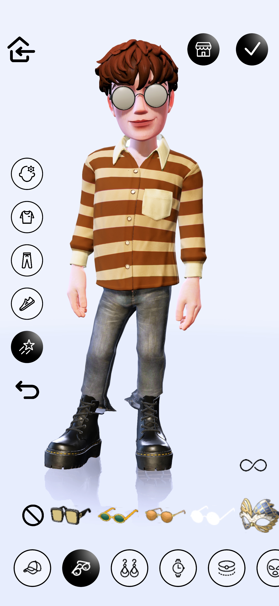
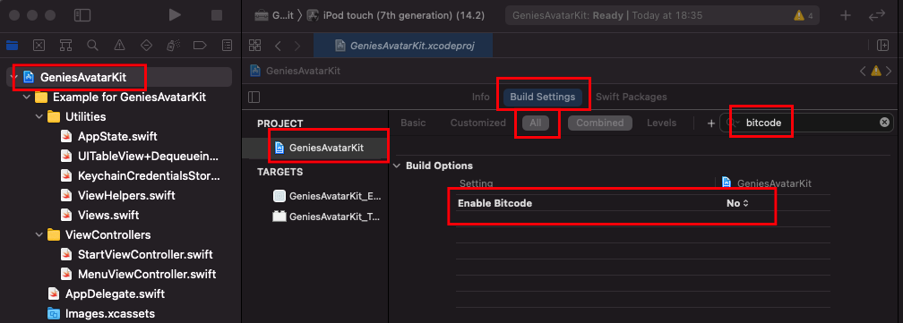

# Avatar Creator 
The Avatar Creator is a SDK component that lets the user build their own personalized Avatar. 

{: style="width:300px"}
{: style="width:300px"}

The Avatar Creator is a Unity plugin made available through an Android Library and an iOS Library. 

## Android

To make the Avatar Creator easier to integrate in your Android App we created a library: https://github.com/geniesinc/android-composer-library 

### Integration
To integrate the Avatar Creator library follow these steps: 

1. Open build.gradle (project) file and add to allprojects/repositories:
 ```
 maven {
            url 'https://jitpack.io'
            credentials { username authToken }
        }
 ```
 2. Open gradle.proprties and add: 
 ```
 authToken={{YOUR_AUTH_TOKEN}}
 ```
 The `authToken` will be provided when [applying for a Partner Account](index.md#step-one-apply-for-a-partner-account).
 3. Open build.gradle (Module: app) file. Add to dependencies: 
 ```
 implementation 'com.github.geniesinc:android-composer-library:0.0.11'
 ```
 4. Open strings.xml and add:
 <string name="game_view_content_description">Avatar Creator</string>
 
 5. The Avatar Creator needs to be loaded in a separate activity with a dedicated process attached. The Avatar Creator Unity plugin kills the current process when it unloads.

 6. In the activity, to add the Avatar Creator view:
```
  val composerCallback = object: GeniesComposerLoader.ComposerCallback {
      override fun onComposerLoaded() {
          Log.d(TAG, "Composer loaded")
          pb_loading.visibility = View.GONE
      }

      override fun onComposerUnloaded() {
          Log.d(TAG, "Composer unloaded")
      }
}

GeniesComposerLoader.loadGeniesComposerIntoView(
   parentView = composer_container,
   lifecycleOwner = this,
   credentialsJson = testCredentials,
   composerCallback = composerCallback
)
```

The credentialsJson should be a JSON String containting: 

 - the user `userId`
 - [the Partner's API Account Refresh Token](authentication.md#partner-api-account-sign-in)
 - the Partner's API Key provided when [applying for the Partner Account](index.md#step-one-apply-for-a-partner-account)

**Example**
```
{
    userId: {{AVATAR_USER_ID}},
    refreshToken: {{PARTNER_API_ACCOUNT_REFRESH_TOKEN}},
    apiKey: {{PARTNER_API_KEY}}
}
```

### Callbacks

When loading the Avatar Creator you can supply a `GeniesComposerLoader.ComposerCallback`. 

`onComposerLoaded()` getts called when the Avatar Creator finishes loading the user Avatar and is ready to be visible on screen. 

`onComposerUnloaded()` getts called when a user action (SAVE, QUIT) triggers the closing of the Avatar Creator. 

## iOS

### Installation

You can install the iOS Genies Avatar library via **Cocoapods**:

1. Add `pod "GeniesAvatarKit", git: "https://github.com/geniesinc/GeniesAvatarKit.git"` (proper github credentials are
   required)

2. Disable Bitcode in XCode project settings - In XCode go to your `project settings` > `Build Settings` > Make
   sure `All` is selected and search for `bitcode` - Set it to `Enabled = No`



3. In AppDelegate add the following:

```swift
import Foundation
import UIKit
import GeniesAvatarKit

// Required
import MachO

@UIApplicationMain
class AppDelegate: UIResponder, UIApplicationDelegate {

    var window: UIWindow?

    func application(_ application: UIApplication, didFinishLaunchingWithOptions launchOptions: [UIApplication.LaunchOptionsKey : Any]?) -> Bool {
        window = UIWindow(frame: UIScreen.main.bounds)

        // Add the following:
        UnityLoader.setHostMainWindow(window)
        UnityLoader.setLaunchOptions(launchOptions)        
        let machineHeader = UnsafeMutablePointer<mach_header_64>.allocate(capacity: 1)
        machineHeader.pointee = _mh_execute_header
        UnityLoader.machineHeader = machineHeader

        window?.rootViewController = StartViewController()
        window?.makeKeyAndVisible()
        return true
    }

}
```

### Loading

Loading the composer is then done anywhere in the app by using `UnityLoader.loadComposerWithCredentials`:

```swift
func loadUserInUnity(_ user: AvatarAPIClient.User) {
    guard let refreshToken = AvatarAppState.shared.credentials?.refreshToken else {
        print("Error: The refresh token does not exist")
        return
    }

    let credentials = AvatarComposerCredentials(userId: user.userId,
                                                refreshToken: refreshToken,
                                                apiKey: AvatarAppState.shared.client.apiConfig.apiKey)

    guard let jsonCredentialsString = credentials.jsonString else {
        print("Error: Cannot create composer credentials JSON")
        return
    }

    UnityLoader.loadComposerWithUserCredentials(jsonCredentialsString) {
        UnityLoader.showUnity()
    }
}
```

You can read more about the `AvatarAppState` object [here](ios.md#state)

### Unloading

Unloading the composer is done via `UnityLoader.hideUnity()`